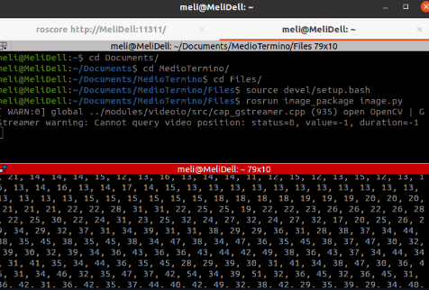
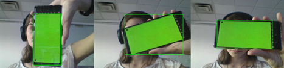

# Tarea Medio Término Interfases
TE3003B.503 > Tarea Medio Término Interfases
Melissa Montemayor Riojas > A01283698

## 1. Capturar una imagen de la webcam por un ROS Node en Python (en Linux), detectar un objeto verde en la imagen, calcular las coordenadas X y Y del objeto (se puede utilizar un Aruco para el mismo fin).

### Nodos y qué hace cada uno:
### Publicar imagen
`Image.py`

1. Imagen de demostración donde obtenemos los vectores de la imagen.

`image_node`Es el nodo encargado de publicar la imagen de la cámara al tópico `image_topic`.  

### Detectar objetos verdes 
`object_node`
Este nodo es el encargado de la detección de los objetos color verde y obtener las coordenadas para publicarlas en `object_topic`.

## 2. Crear una librería de C++ (*.so en Linux, *.dll en Windows) que multiplique los valores de las coordenadas por 100.

## 3. Cargar la librería de C++ en el ROS Node para hacer la operación de multiplicación.

## 4. Publicar el resultado con su timestamp en un ROS Topic.

## 5. Crear un Wrapper de gRPC para convertir el ROS Topic de las coordenadas del objeto a un servicio RPC.

## 6. En C# crear un programa que tome las coordenadas del objeto desde el servicio RPC y las despliegue en la terminal. (De preferencia en Windows con Visual Studio, pero se puede utilizar Java o MonoDevelop en Linux).
## 7. Utilizar grpc-Gateway para que el Wrapper haga disponible el servicio como un REST-API
## 8. En Postman (o Flask en Python), adquirir las coordenadas de objeto desde el nuevo REST-API, y guardar el dato en un archivo JSON.
